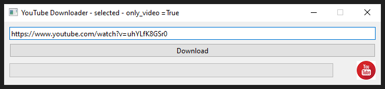
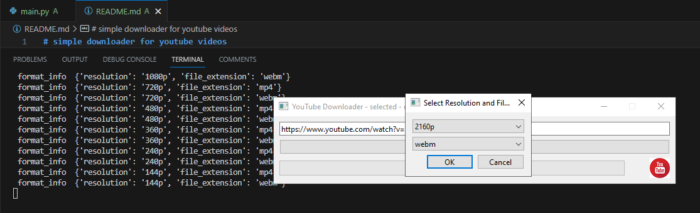

# simple downloader for youtube videos 

 - this is created with python programming language and PyQt6 

 - the selection of video from url is by video 

 - you cannot see some file types because this criteria 

 - these screenshots from application with the URL : https://www.youtube.com/watch?v=uhYLfK8GSr0 I tested: 
 
 

 
